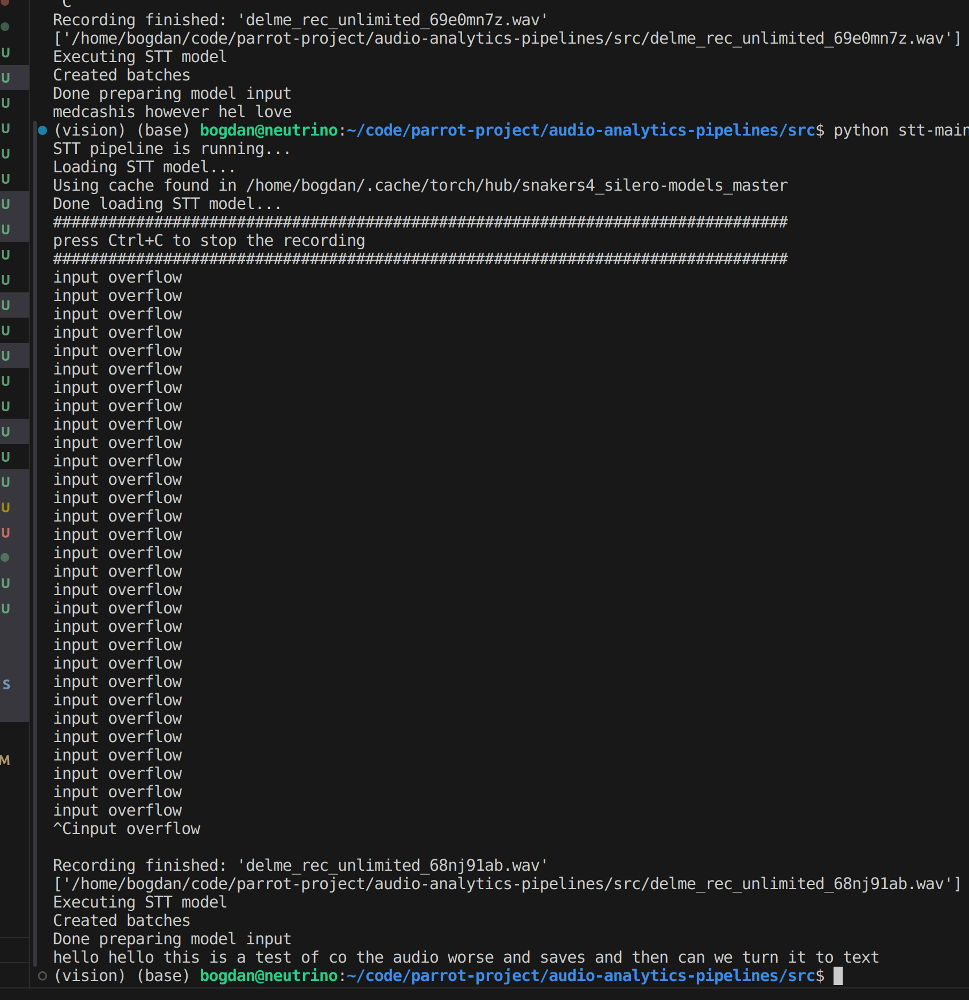

# parrot-project

## About the project
Audio focused Deep learning tool for scrapbooking our lives

## Supported modules
1. `general-model-server` - A general model server that can be used to serve models in a variety of ways
2. `parrot-frontend` - A frontend that can be used to interact with the model server using react native
3. `audio-analytics-pipelines` - Research repos for audio analytics pipelines

## Framework Stack
* Tensorflow
* Pytorch
* Nvidia Triton Inference Server
* AWS
* React Native
* Docker
* Kubernetes
* Cuda

## Example Use Cases
### Audio -> Dicussion/Scrapbook 

---
### Speech to Text

