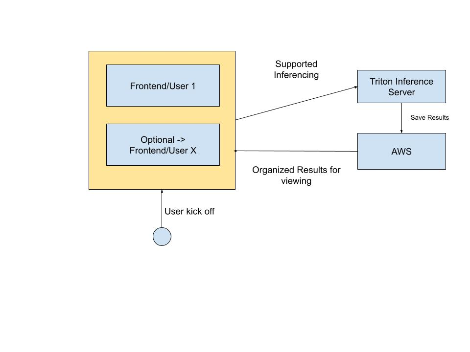

# Deep Learning Scrapbook Project(parrot-project -> Boston Wearables)

Welcome to the Deep Learning Scrapbook Project! This project is designed to help you capture, organize, and explore visual memories using cutting-edge deep learning techniques. The scrapbook application allows users to create digital scrapbooks where images, videos, and text can be collated and annotated with automated insights, such as object detection, scene recognition, and facial recognition.

## About the project
Audio focused Deep learning tool for scrapbooking our lives

## Supported modules
1. `general-model-server` - A general model server that can be used to serve models in a variety of ways
2. `parrot-frontend` - A frontend that can be used to interact with the model server using react native
3. `audio-analytics-pipelines` - Research repos for audio analytics pipelines

## Framework Stack
* Tensorflow
* Pytorch
* Nvidia Triton Inference Server
* AWS
* React Native
* Docker
* Kubernetes
* Cuda

High level architecture diagram

## Example Use Cases
### Audio -> Dicussion/Scrapbook 

---
### Speech to Text

